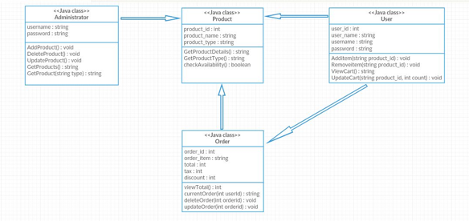

# Project Title
EMUSICSTORE

Music Store Ecommerce website using Java Spring

## Description
To build an E-commerce Music store web application using Model View Controller concept. We use Java spring in the backend and Angular JS supported by other frameworks in the frontend. This application serves to buying of music products like instruments, cd's, or accesories etc.

Target User:
The target users are music fanatics, learners who want learn music, music collectors etc.
User Stories and Usage Scenarios:
1. Create
User Story :  As an administrator, I want to add products for the users to choose from for buying.
Usage Scenario :
i.	Admin logs on into the system.
ii.	Clicks on Add products
iii.	Gives product information
iv.	Submits the product

User Story : As a user, I want to add a product to my cart
Usage Scenario : 
i.	User logs on into the system
ii.	User selects a product from the listings
iii.	User selects Add to cart button/ Buy button

2. Read
User Story : As an administrator, I want to view the users in music store who have made purchases
Usage Scenario : 
i.	Admin logs on into the system
ii.	Clicks view users
iii.	Gives result of registered users

User Story: As a user, I want to view my cart which contains my added items
Usage Scenario : 
i.	User logs on into the system
ii.	User selects view my cart option from menu

3. Update
User Story : As an administrator, I want to update a product detail which already exists
Usage Scenario :
i.	Admin logs on into the system
ii.	Selects the required product to be updated
iii.	Clicks update
iv.	Updates the product detail
v.	Click save

User Story : As a user, I want to update my cart and edit quantity
Usage Scenario:
i.	User logs on into the system
ii.	User selects view my cart option from menu
iii.	User edits quantity of the product added onto the cart. 
iv.	Clicks save/Buy

4. Delete
User Story: As an administrator, I want to delete a product from the product listings
Usage Scenario:
i.	Admin logs on into the system
ii.	Selects the required product to be deleted
iii.	Clicks delete product

User Story : As an user, I want to delete a product from my cart
Usage Scenario:
i.	User logs on into the system
ii.	User selects view my cart option from menu
iii.	user deletes a product from the cart

#### Class Diagram

